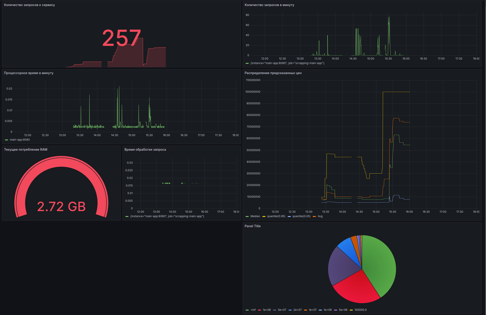

# Мониторинг

## Для мониторинга выбраны метрики:

* Количество (сумма) поступивших запросов `main_app_predictions_count` - общая заинтересованность сервисом. Можно следить за тенденцией роста\спада интереса. Удобоно представить в виде временного ряда и текущего значения 
* Количество запросов в минуту `increase(main_app_predictions_count[1m])` - оцениваем нагрузку на систему, необходимость масштабирования Представляем в вмде временного ряда.
* Среднее предсказанное значение `main_app_predictions_sum / main_app_predictions_count`
* Гистограмма предсказанных цен `main_app_predictions_bucket` - - следим за качеством модели и необходимостью переобучения - не стала ли модель часто предсказывать необычные значения. Отображаем на одном графике квантили 0.05, 0.95, медианы и среднего предсказанного значения, а также в виде круговой диаграммы по корзинам.

* Время обработки запроса `rate(main_app_predictions_count[1m]) / increase(main_app_predictions_count[1m])` Производительность системы. Можем контролировать проблемы с железом, загруженность. Отображаем на временной шкале

### Инфраструктурные метрики:
Следим за основными характеристиками железа 
* Текущее потребление RAM `process_virtual_memory_bytes`
* Процессорное время в минуту `avg by (instance) (irate(process_cpu_seconds_total[1m]))` - Отображаем загрузку на временной шкале

